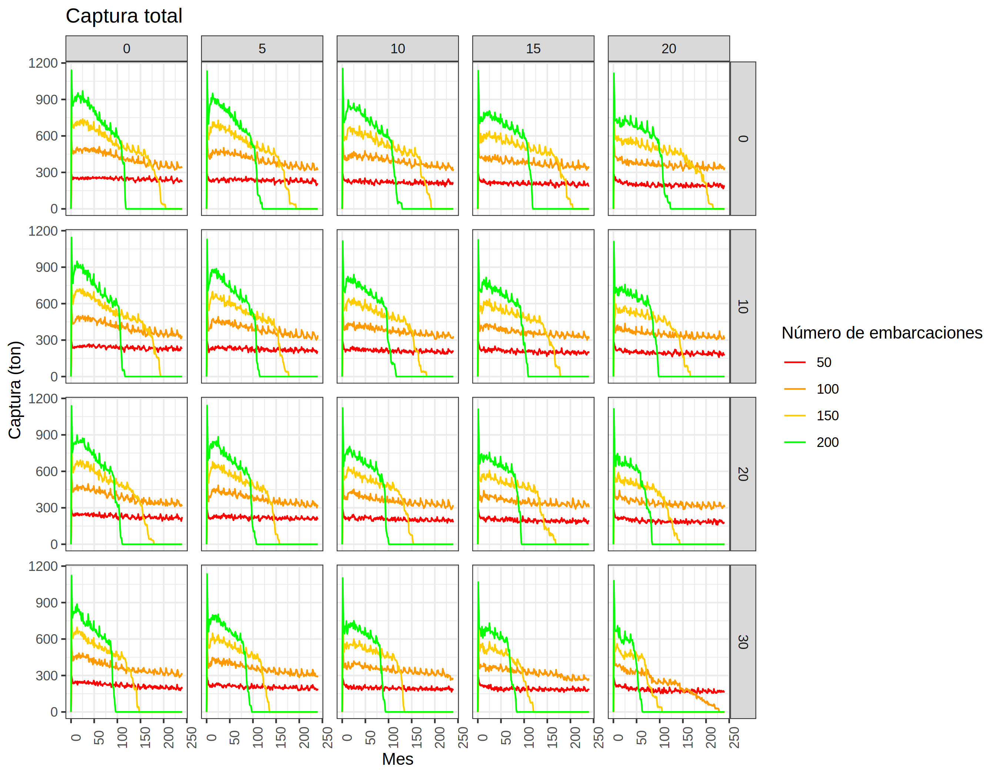
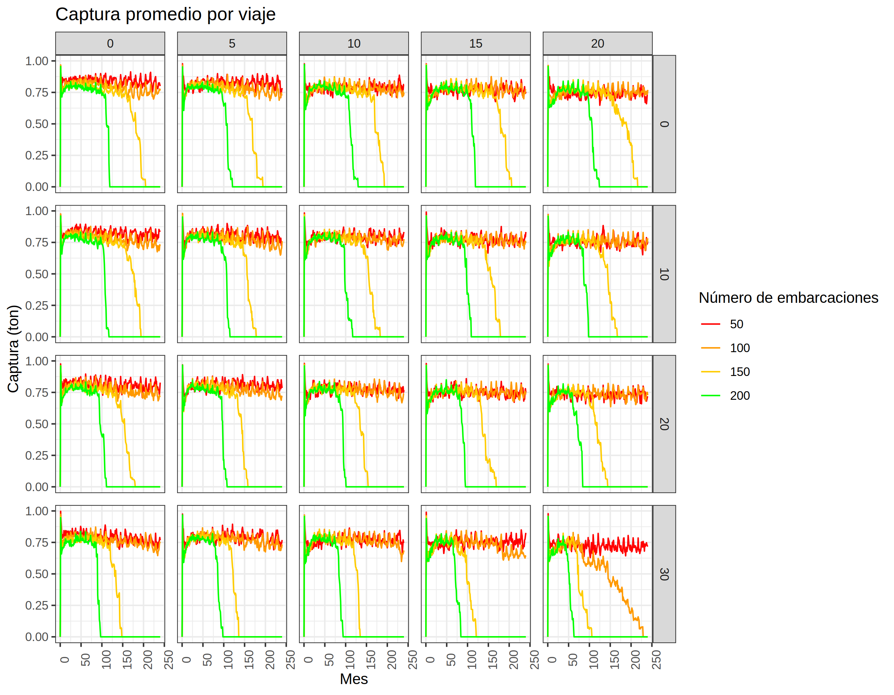
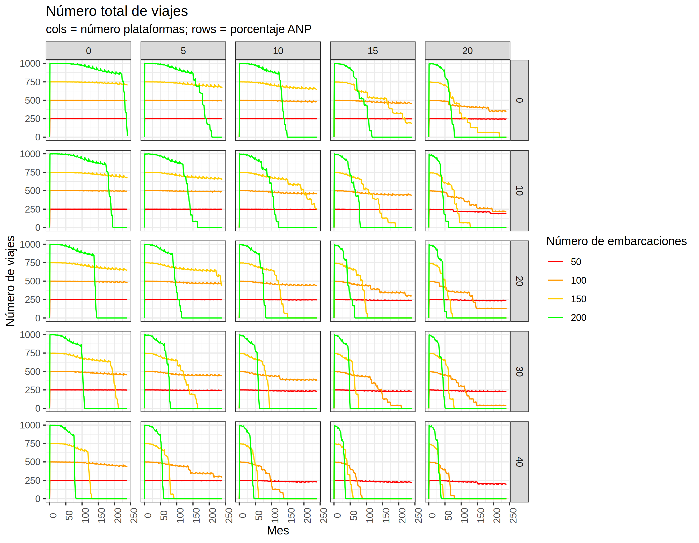
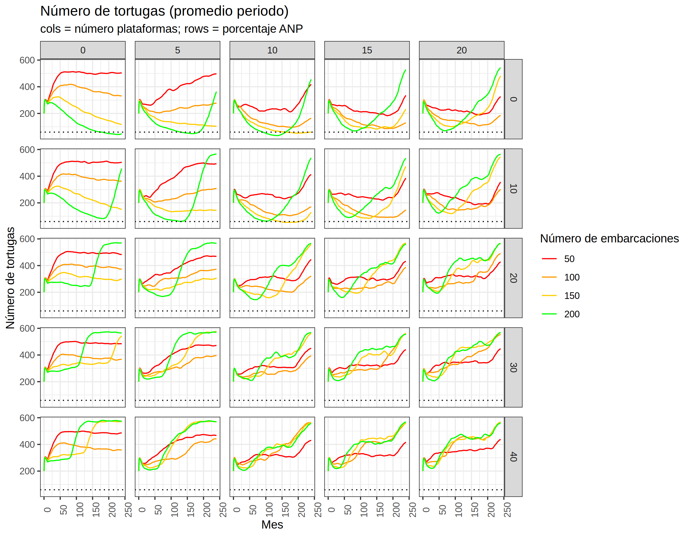
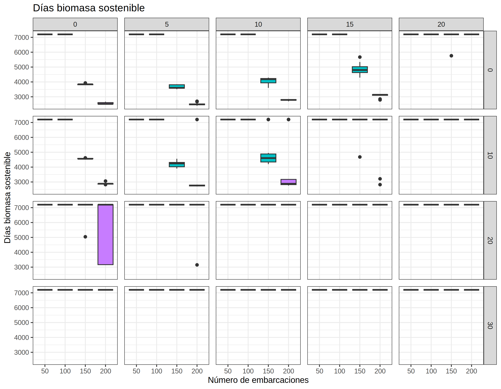

## Descripción de experimentos
Se exploraron 200 escenarios que representan todas las combinaciones de
las siguientes variables y rangos:
1. `NUMERO_EMBARCACIONES`: 25, 50, 75, 100, 125, 150, 175, 200
2. `NUMERO_PLATAFORMAS`: 0, 5, 10, 15, 20
3. `LONGITUD_AREA_PROTEGIDA`: 0, 10, 20, 30, 40

Cada simulación duró 20 años y se realizaron 30 repeticiones por escenario.

En las simulaciones se utilizaron los siguientes parámetros base:

| Submodelo | Parámetro | Valor |
|-|-|-|
| pesca | HORAS_DESCANSAR | 12 |
| pesca | PROB_EXPLORAR | 0.2 |
| pesca | RADIO_EXPLORAR | 3 |
| pesca | NUM_AMIGOS | 2 |
| pesca | DIAS_MAXIMOS_EN_MAR | 5 |
| pesca | CAPTURABILIDAD | 0.01 |
| pesca | VELOCIDAD | 0.5 |
| pesca | CAPACIDAD_MAXIMA | 1 |
| pesca | LITROS_POR_DISTANCIA | 1 |
| pesca | LITROS_POR_HORA_PESCA | 1 |
| pesca | NUM_TRIPULANTES | 3 |
| pesca | PRECIO_BIOMASA | 10000 |
| pesca | PRECIO_LITRO_GAS | 30 |
| ecología | K | 50 |
| ecología | M | 0.0001 |
| ecología | R | 0.8 |
| hidrocarburo | HODROCARBURO_INICIAL | 20000 |
| hidrocarburo | EXTRACCION_MAX_HIDROCARBURO | 5 |
| hidrocarburo | TASA_DECLINACION_HIDROCARBURO | 0.001 |
| hidrocarburo | PROB_OCURRENCIA_DERRAME | 0.025 |
| hidrocarburo | PROB_EXTENSION_DERRAME | 0.35 |
| hidrocarburo | PROB_MORTALIDAD_DERRAME | 0.75 |
| hidrocarburo | TIEMPO_DERRAMADO | 50 |
| hidrocarburo | COSTO_POR_CELDA_DERRAMADA | 10000 |
| hidrocarburo | COSTO_OPERACION_PLATAFORMA | 1000 |
| hidrocarburo | PRECIO_HIDROCARBURO | 10000 |
| hidrocarburo | RADIO_RESTRICCION | 3 |
| hidrocarburo | SUBSIDIO_MENSUAL_GASOLINA | 0 |
| hidrocarburo | CENTRO_MAX_PROB_PLATAFORMAS | 25 |
| hidrocarburo | RADIO_PROB_PLATAFORMAS | 15 |
| tortugas | POB_INICIAL_TORTUGAS | 200 |
| tortugas | NUM_DESCENDIENTES | 1 |
| tortugas | MAX_CAPACIDAD_CARGA | 5 |
| tortugas | PROB_MORTALIDAD_TORTUGA_PESCA | 0.006 |
| tortugas | PROB_MORTALIDAD_TORTUGA_DERRAME | 0.10 |
| zonificación | ANCHO_ZONA_PROTEGIDA | 19 |
| mundo | HORAS_ITERACION | 24 |
| mundo | LONGITUD_CELDA | 1 |
| mundo | LONGITUD_TIERRA | 6 |
| jugabilidad | SALARIO_MIN_MENSUAL | 7000 |
| jugabilidad | MAX_MESES_CRISIS_PESCA | 12 |
| jugabilidad | PORCENTAJE_BIOMASA_CRISIS | 50 |
| jugabilidad | PORCENTAJE_BIOMASA_COLAPSO | 25 |
| jugabilidad | MAX_MESES_CRISIS_HIDROCARBURO | 12 |
| jugabilidad | PORCENTAJE_TORTUGAS_CRISIS | 50 |
| jugabilidad | PORCENTAJE_TORTUGAS_COLAPSO | 25 |

## Series de tiempo

### Captura total

Para todos los escenarios explorados se observa que conforme aumenta
el número de embarcaciones aumenta la captura durante los primeros meses.
Posteriormente las capturas bajan rápidamente. Para todos los escenarios
tener más de 100 embarcaciones resulta en reducciones abruptas en las
capturas (en algunos casos 100 embarcaciones tambien generan cambios
abruptos).

Conforme aumenta el número de plataformas las capturas parecen reducirse.
Las condiciones de disminución abrupta (más de 100 embarcaciones) se
mantienen, solo que a partir de 10 plataformas el cambio parece ser menos
abrupto. 

Al aumentar el tamaño de la zona protegida las capturas disminuyen.
A partir de una longitud de zona protegida de 30 el escenario con 100
embarcaciones que sin zona protegida no colapsaban se aproxima al colapso
al final de la simulación. Con 40 de zona protegida el verde colapsa a la
mitad de la simulación. Parece haber un efecto conjunto de la zona protegida
y el número de plataformas: conforme aumentan ambos la caida aburpta de la
captura se alcanza más rápido.

### Captura por viaje

La captura por viaje tiende a disminuir conforme aumenta el número de
embarcaciones. Esta tendencia aumenta conforme aumenta el número de plataformas
y el tamaño de la zona protegida.

### Biomasa total

Al inicio de las simulaciones la biomasa disminuye conforme aumenta el
número de embarcaciones. El umbral del 25% se alcanza solamente cuando
no hay zonas protegidas para los casos con 100 o más embarcaciones. Al avanzar
la simulación la biomasa se recupera en los casos cuando la pesca colapsa. 

### Número de viajes

El número de viajes se comporta de manera idéntica a la captura total. Esto
indica que la reducción en la captura total en el modelo se debe principalmente
a la reducción en el número de viajes que se realizan.

### Horas en mar promedio por viaje

Las horas promedio en mar aumentan de manera asintótica conforme avanza la
simulación. En los casos donde la pesquería colapsa se las horas en mar
disminuyen hasta cero.

Conforme aumenta el número de plataformas el número promedio de horas en el mar
tiende a disminuir. Aunque para los escenarios con pocas embarcaciones si
parece aumentar ligeramente.

Conforme aumenta el tamaño del área protegida en los escenarios con pocas
embarcaciones las horas en mar tienden a aumentar. 

### Distancia recorrida promedio por viaje

La distancia recorrida por viaje aumenta con el número de embarcaciones.
Conforme auentan el número de plataformas y el tamaño de la zona protegida
la distancia recorrida no aumenta.

### Gasto en gasolina promedio por viaje

El gasto en gasolina se comporta igual que la distancia recorrida por viaje.
No tiende a aumentar conforme se aumenta el número de plataformas y zonas
protegidas.

### Ganancia por viaje

Las ganancias aumentan conforme se disminuye el número de embarcaciones. Esto
se puede entender como resultado de que las capturas por viaje son mayores
cuando hay menos embarcaciones. Las plataformas y áreas protegidas disminuyen
las ganancias.

### Salario mensual promedio

Se comporta igual que la ganancia: el salario mensual aumenta conforme
disminuye el número de embarcaciones, y el número de plataformas y largo
de zona protegida disminuyen el salario.

## Acumulado y total

### Captura acumulada

## Trayectorias de juego

