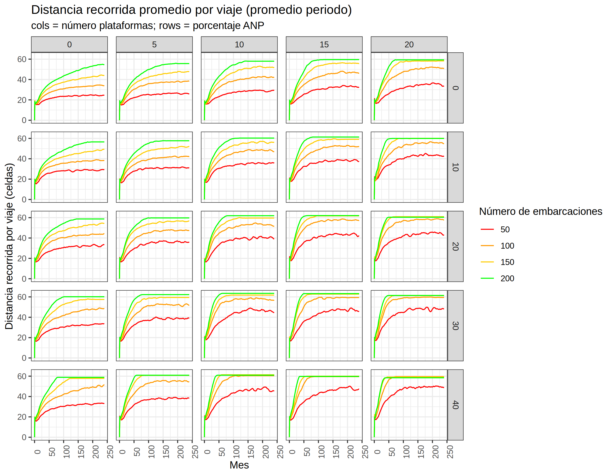
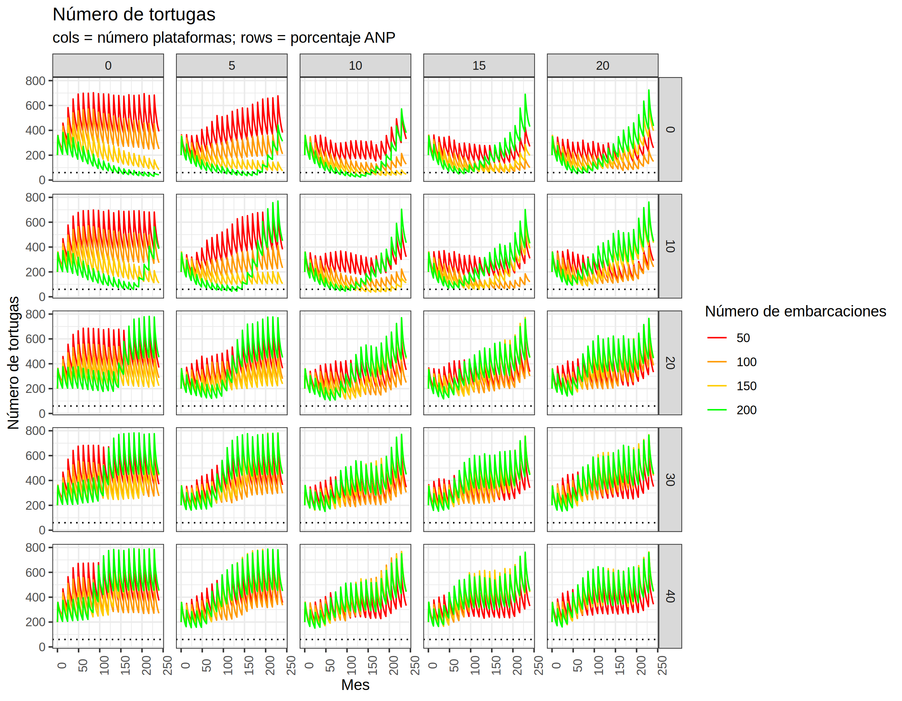
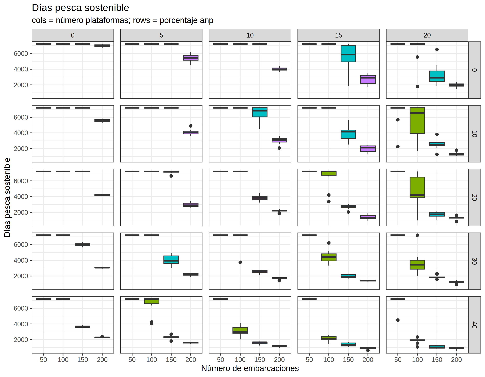
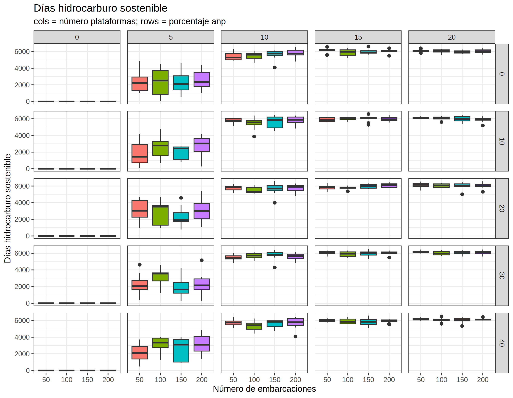

Se realizaron simulaciones para identificar las trayectorias del submodelo
de pesca con un conjunto de parámetros base. Lo único que se vario en las
simulaciones es el número de embarcaiones de 10 a 200 con saltos de 10.
## Parámetros base
En las simulaciones se utilizaron los siguientes parámetros base:

| Submodelo | Parámetro | Valor |
|-|-|-|
| pesca | HORAS_DESCANSAR | 12 |
| pesca | PROB_EXPLORAR | 0.2 |
| pesca | RADIO_EXPLORAR | 3 |
| pesca | NUM_AMIGOS | 2 |
| pesca | **NUMERO_EMBARCACIONES** | varia |
| pesca | DIAS_MAXIMOS_EN_MAR | 5 |
| pesca | CAPTURABILIDAD | 0.01 |
| pesca | VELOCIDAD | 0.5 |
| pesca | CAPACIDAD_MAXIMA | 1 |
| pesca | LITROS_POR_DISTANCIA | 1 |
| pesca | LITROS_POR_HORA_PESCA | 1 |
| pesca | NUM_TRIPULANTES | 3 |
| pesca | PRECIO_BIOMASA | 10000 |
| pesca | PRECIO_LITRO_GAS | 20 |
| ecología | K | 50 |
| ecología | M | 0.001 |
| ecología | R | 0.6 |
| hidrocarburo | **NUMERO_PLATAFORMAS** | 0 |
| hidrocarburo | HODROCARBURO_INICIAL | 20000 |
| hidrocarburo | EXTRACCION_MAX_HIDROCARBURO | 10 |
| hidrocarburo | TASA_DECLINACION_HIDROCARBURO | 0.001 |
| hidrocarburo | PROB_OCURRENCIA_DERRAME | 0.025 |
| hidrocarburo | PROB_EXTENSION_DERRAME | 0.35 |
| hidrocarburo | PROB_MORTALIDAD_DERRAME | 0.5 |
| hidrocarburo | TIEMPO_DERRAMADO | 50 |
| hidrocarburo | COSTO_OPERACION_PLATAFORMA | 1000 |
| hidrocarburo | PRECIO_HIDROCARBURO | 10000 |
| hidrocarburo | RADIO_RESTRICCION | 4 |
| hidrocarburo | SUBSIDIO_MENSUAL_GASOLINA | 0 |
| tortugas | **LARGO_ZONA_PROTEGIDA** | 0 |
| tortugas | **ANCHO_ZONA_PROTEGIDA** | 0 |
| tortugas | POB_INICIAL_TORTUGAS | 150 |
| tortugas | NUM_DESCENDIENTES | 1 |
| tortugas | CAPACIDAD_CARGA | 2 |
| tortugas | PROB_MORTALIDAD_TORTUGA_PESCA | 0.008 |
| tortugas | PROB_MORTALIDAD_TORTUGA_DERRAME | 0.15 |
| mundo | HORAS_ITERACION | 24 |
| mundo | LONGITUD_CELDA | 1 |
| mundo | LONGITUD_TIERRA | 6 |
| jugabilidad | SALARIO_MIN_MENSUAL | 7000 |
| jugabilidad | MAX_MESES_CRISIS_PESCA | 12 |
| jugabilidad | PORCENTAJE_BIOMASA_CRISIS | 50 |
| jugabilidad | PORCENTAJE_BIOMASA_COLAPSO | 25 |
| jugabilidad | MAX_MESES_CRISIS_HIDROCARBURO | 12 |
| jugabilidad | PORCENTAJE_TORTUGAS_CRISIS | 50 |
| jugabilidad | PORCENTAJE_TORTUGAS_COLAPSO | 25 |

## Series de tiempo

### Captura total

### Captura por viaje

### Biomasa total

### Numero de viajes

### Horas en mar por viaje

### Distancia recorrida por viaje

### Gasto en gasolina por viaje

### Ganancia por viaje

### Salario promedio mensual

## Acumulados y finales

### Captura acumulada final

### Biomasa final

### Ganancia acumulada final

### Número tortugas acumulado

## Tiempos de sostenibilidad
### Tiempo pesca sostenible

### Tiempo biomasa sostenible

### Tiempo tortugas sostenible

## Trayectorias representativas
Para el conjunto de parametros base se identificó que la cantidad óptima
de embarcaciones es 100. Esto se debe a que con este valor no se supera
ninguno de los umbrales de sostenibilidad y se obtienen altas capturas
y ganancias acumuladas.

A partir de estas simulaciones se pueden identificar 4 escenarios a los
que se podrían acotar las exploraciones:

1. *Sub-pesca*: con 50 embarcaciones, no se supera ningún umbral de
juego, se obtiene un alto salario mensual, pero la captura y ganancia
acumuladas son bajas.
2. *Óptimo*: con 100 embarcaciones, no se supera ningún umbral de juego,
se obtiene un salario mensual aceptable, la captura y ganancia acumuladas
son altos (más altos que con 50).
3. *Sobre-pesca límite*: con 150 embarcaciones, se superan todos los
umbrales de juego a partir de los 15 años, se obtienen las máximas capturas y ganancias acumuladas pero no son sostenibles.
4. *Sobre-pesca extrema*: con 200 embarcaciones, se superan todos los
umbrales de juego en menos de 10 años, se obteienen ganancias acumuladas
menores a con 150 pero similares a con 100.

En las siguientes gráficas se muestran las trayectorias representativas
promedio de 30 simulaciones y sus máximos y mínimos.

### Captura total

### Captura por viaje

### Biomasa

### Numero viajes

### Horas en mar por viaje

### Distancia recorrida por viaje

### Gasto en gasolina por viaje

### Ganancia por viaje

### Salario mensual promedio

### Tortugas

